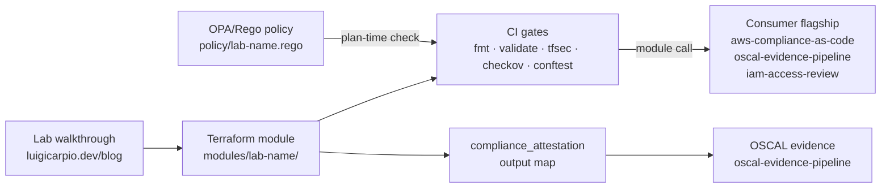

# AWS GRC Terraform Modules

Reusable Terraform modules implementing FedRAMP High and CJIS v6.0 baselines on AWS. Each module is one self-contained compliance unit (IAM hardening, KMS CMK, S3 with SSE/Object Lock, VPC enclave boundary, CloudTrail multi-region, AWS Config recorder, Security Hub, GuardDuty) and ships with NIST 800-53 Rev 5 control mappings, OPA/Rego policy tests, and tfsec/checkov gates wired into CI.

This repo is the Terraform half of the **AWS Fundamentals Labs Curriculum** — a 10-lab series where every lab pairs a Console-first walkthrough on [`luigicarpio.dev/blog`](https://luigicarpio.dev/blog) with a matching module here. The pairing keeps the IaC defensible at the AWS-service level (CGE-P Domain 2 alignment) without abandoning click-path fluency.

> **Status:** v1.0 chassis under construction. **`iam-hardening` (Lab 1) v1.1.0 implemented** in `modules/iam-hardening/` — password policy, RequireMFA, baseline groups, Lab* roles, Access Analyzer, self-verifying `compliance_attestation`. Other modules land as their corresponding labs ship.

## Why This Exists

Most "compliant Terraform" you find on GitHub is a single monolithic stack — useful as a reference, hard to reuse. This repo inverts the layout: the unit of reuse is the **module**, not the stack. A flagship project (`aws-compliance-as-code`, `oscal-evidence-pipeline`, `iam-access-review`) consumes the module it needs, composes it with project-specific config, and inherits the control coverage without re-implementing the baseline. The compliance contract lives in the module — encoded as HCL variable defaults, OPA/Rego policy bundles, and a self-verifying `compliance_attestation` output that downstream OSCAL evidence pipelines cite as proof.

The repo also serves a public-safety SaaS audience. Module defaults target the strictest applicable framework — CJIS v6.0 where it exceeds FedRAMP High (agency-managed CMKs, 1-year audit retention with Object Lock, AAL2 MFA patterns).

## Architecture Overview



Each module is self-contained (`main.tf`, `variables.tf`, `outputs.tf`, `versions.tf`, `README.md`, `policy/*.rego`, `examples/`). The Console walkthrough on `luigicarpio.dev` documents the click-path equivalent of the HCL, so an auditor or reviewer can verify either the IaC OR the Console-driven implementation against the same control mapping.

## Compliance Controls Addressed

Composite across the planned module set. Each module's `README.md` carries the precise control-to-resource mapping for that module.

| NIST 800-53 Rev 5 | FedRAMP High | CJIS v6.0 | What It Enforces |
|---|:---:|:---:|---|
| AC-2, AC-3, AC-6 | Yes | 5.5.x delta | `iam-hardening` — group-based access, RequireMFA deny gate, tiered grants, CJI-user tagging |
| IA-2 (1)(2), IA-5 | Yes | IA-2 AAL2 delta | `iam-hardening` — RequireMFA deny gate (BoolIfExists), MFA-required auditor role trust, account password policy (max age / complexity) |
| SC-12, SC-13, SC-28 | Yes | 5.10.1.2.x delta | `kms-key-management` + `s3-compliant-bucket` — agency-managed CMK only, FIPS endpoints, automatic rotation, SSE-KMS on storage |
| SC-7, SC-7(5), AC-4 | Yes | 5.10 boundary | `vpc-boundary` — public/private subnets, SG+NACL least privilege, flow logs, VPC endpoints for S3/KMS |
| AU-2, AU-6, AU-9, AU-12 | Yes | 5.4.x (1-yr) | `cloudtrail-multi-region` — org trail, KMS-encrypted log archive, log integrity validation, S3 Object Lock |
| CA-7, CM-3, CM-6 | Yes | — | `config-recorder` + NIST 800-53 conformance pack; required-tag enforcement via `merge()` |
| SI-4, RA-5, SI-4(2) | Yes | — | `guardduty-eventbridge` — detection + EventBridge → SNS pipeline |

## How an Auditor Uses This Output

The artifact every module produces is a `compliance_attestation` output — a structured map of booleans and scalars derived from the actual deployed resource state, not from variable defaults. An auditor mapping control implementation evidence to a FedRAMP control baseline can:

1. Read the `controls_satisfied` array directly — it lists the NIST 800-53 Rev 5 controls the module's resources address
2. Inspect each per-control boolean (e.g., `password_policy_meets_minimums`, `auditor_role_mfa_trust_enforced`, `mfa_enforcement_policy_on_all_groups`) which is computed from actual resource attributes (not from input variables), so the attestation self-verifies
3. Consume the JSON form via `terraform output -json compliance_attestation` and pipe it into an OSCAL Component Definition `implemented-requirement` entry as the evidence URI

This maps directly to NIST 800-53A assessment objectives: the attestation answers the **EXAMINE** procedure (configuration matches required state) without requiring an assessor to manually screenshot the AWS Console. For FedRAMP 20x submissions, the same JSON is the machine-readable artifact a Plan of Action and Milestones (POA&M) automation would consume to verify remediation.

The evidence loop the modules feed: **detect** (CI gates run on every PR) → **transform** (module outputs JSON-ready attestation) → **retain** (consumer flagship persists attestation to OSCAL store) → **review** (assessor reads attestation, no manual transcription).

## FedRAMP 20x Alignment

- **Compliance-as-code:** Each module encodes its controls as HCL variable defaults, an OPA/Rego policy bundle (`policy/*.rego` with `*_test.rego`), and a `compliance_attestation` map literal. The compliance contract is the code; drift is detectable via `terraform plan` diff against the module bundle.
- **Machine-readable evidence:** `compliance_attestation` output → JSON → OSCAL `observation` / `finding` consumed by `oscal-evidence-pipeline`. No manual transcription, no screenshots, no spreadsheets.
- **Automated scanning:** CI gates run `tfsec`, `checkov`, and `conftest test` (OPA) against every module on every PR. A module cannot merge while a policy gate fails.
- **API-driven evidence:** `terraform output -json compliance_attestation` is the canonical evidence endpoint; consumer flagships read it programmatically.
- **30-day vs 90-day review window:** Modules produce machine-readable artifacts on every apply — the 30-day continuous monitoring SLA window applies, not the 90-day manual review window. Each module's apply timestamp is the evidence freshness anchor.

## CJIS v6.0 Relevance

Module defaults target CJIS v6.0 where it exceeds FedRAMP High. The three primary deltas:

- **Agency-managed CMK only (SC-12, SC-13, SC-28).** Every module that touches encryption uses a customer-managed `aws_kms_key` with an explicit key policy. AWS-managed keys are not exposed as a configuration option — the module won't accept them. GovCloud FIPS 140-2/3 boundary differences are annotated in `kms-key-management/README.md` rather than deployed (single-user commercial AWS access).
- **CJI-user tagging convention (AC-2 delta).** `iam-hardening` exposes a `cji_user_role` tag on human-assumable roles that downstream quarterly access review automation can filter on. Required tags are layered on top of consumer tags via `merge(var.tags, local.required_tags)` so they cannot be suppressed.
- **1-year minimum audit retention with weekly review (AU-6 delta).** `cloudtrail-multi-region` sets `s3_object_lock_retention_days >= 365` as a variable default, with plan-time validation enforcing `>= 365` when `environment == "prod"` using the boolean implication `(env != "prod") ∨ (retention >= 365)`. Weekly-review evidence tags are emitted in the attestation output.

CJIS v6.0 became audit standard April 1, 2026 and aligns with NIST 800-53 Rev 5 as of December 2024.

## Sample Evidence Output

A representative `compliance_attestation` output from the `iam-hardening` module (v1.1):

```json
{
  "module": "iam-hardening",
  "module_version": "1.1.0",
  "framework_targets": ["NIST 800-53 Rev 5", "FedRAMP High", "CJIS v6.0"],
  "controls_satisfied": ["AC-2", "AC-3", "AC-6", "IA-2(1)", "IA-2(2)", "IA-5"],
  "environment": "dev",
  "required_compliance_scope": "fedramp-high",
  "password_policy_meets_minimums": true,
  "require_mfa_policy_bool_if_exists": true,
  "mfa_enforcement_policy_on_all_groups": true,
  "auditor_role_mfa_trust_enforced": true,
  "access_analyzer_enabled": true,
  "required_tags_present": true,
  "cji_user_tag_convention_enforced": true
}
```

Each per-control boolean is **computed from actual deployed resource state** (e.g., `auditor_role_mfa_trust_enforced` parses `aws_iam_role.this["LabCrossAccountAuditor"].assume_role_policy` for the `aws:MultiFactorAuthPresent` condition). The module does not claim a control is satisfied — it computes whether the deployed state matches the control's requirements. Per-module `examples/<name>/` consumer scenarios are planned (v1.3.0 roadmap).

## Requirements

- Terraform >= 1.6
- AWS provider >= 5.x
- OPA / conftest >= 0.60 (for `conftest test` CI gate)
- tfsec >= 1.28
- checkov >= 3.x
- `terraform-docs` >= 0.18 (for module README drift check)
- AWS account with credentials configured (commercial AWS; GovCloud differences annotated, not deployed)

## Usage

Each module is consumed via a standard Terraform `module` block:

```hcl
module "iam_baseline" {
  source = "git::https://github.com/0xBahalaNa/aws-grc-terraform-modules.git//modules/iam-hardening?ref=v1.1.0"

  environment               = "prod"
  project_tag               = "compliance-as-code"
  required_compliance_scope = "fedramp-high"
  cji_users_enabled         = true
}

output "iam_compliance_evidence" {
  value = module.iam_baseline.compliance_attestation
}
```

Pin the `?ref=` to a tagged release for reproducible builds. Each module will ship a complete consumer example under `examples/<module-name>/` (v1.3.0 roadmap).

## Repository Structure

```
aws-grc-terraform-modules/
├── modules/
│   ├── iam-hardening/             # Lab 1 — v1.1.0 implemented (password policy, RequireMFA, groups, roles, Access Analyzer)
│   ├── s3-compliant-bucket/       # planned — Lab 2 (S3 with SSE-KMS, Object Lock, TLS-only)
│   ├── vpc-boundary/              # planned — Lab 3 (CJI enclave boundary, SC-7)
│   ├── cloudtrail-multi-region/   # planned — Lab 4 (org trail, log archive, AU-*)
│   ├── config-recorder/           # planned — Lab 5 (Config + custom rules, CA-7, CM-3/6)
│   ├── security-hub/              # planned — Lab 6 (Security Hub posture)
│   ├── kms-key-management/        # planned — Lab 7 (CMK with rotation, SC-12/13/28)
│   └── guardduty-eventbridge/     # planned — Lab 8 (detection + alerting, SI-4)
├── policy/                        # planned — shared OPA bundle + helpers (per-module bundles under modules/<name>/policy/)
├── examples/                      # planned — cross-module integration examples
├── .github/workflows/             # planned — CI: fmt, validate, tfsec, checkov, conftest, terraform-docs drift
├── LICENSE.txt
└── README.md
```

Modules land incrementally as the corresponding lab in the AWS Fundamentals Labs Curriculum ships. See the per-module `README.md` for current status.

## How It Works

**Preventive (plan-time):**

1. **Variable validation.** Every module declares `validation` blocks on inputs that encode compliance contracts. Cross-variable conditions use the boolean identity `(A → B) ≡ (¬A ∨ B)` because HCL `validation` lacks an `if/then` operator. Example: `var.environment != "prod" || var.retention_days >= 365` enforces 1-year retention in production at `terraform plan`, before any resource is created.
2. **Required tags via `merge()`.** Compliance tags (`compliance_scope`, `managed_by`, `framework_target`, etc.) are layered on top of consumer tags via `merge(var.tags, local.required_tags)`. Argument order is deliberate — required tags overwrite consumer attempts to suppress them.
3. **OPA/Rego policy bundle.** Each module ships `policy/<name>.rego` with `default deny` rules and `policy/<name>_test.rego` for unit tests. The CI gate runs `conftest test --policy modules/<name>/policy modules/<name>/plan.json` to enforce policy against the actual plan output.

**Detective (post-apply):**

4. **`compliance_attestation` output.** A computed map literal returning per-control booleans derived from actual resource attributes (not input variables). The module's attestation is self-verifying — an `alltrue([for k in keys(local.required_tags) : contains(keys(resource.tags), k)])` style expression confirms the merge worked, rather than the module claiming it did.

**CI enforcement (per PR):**

5. `terraform fmt -check`, `terraform validate`, `tfsec`, `checkov`, `conftest test`, `terraform-docs --check` all run on every PR. A module cannot merge while any gate fails. Each gate's rule catalog is referenced in the module README so the contract is explicit.

## Future Enhancements

- v1.0 — chassis ships (CI, OPA framework, module template, terraform-docs gate)
- v1.1 — `iam-hardening` (Lab 1) — shipped
- v1.2 — `s3-compliant-bucket` (Lab 2)
- v1.3 — `vpc-boundary` (Lab 3)
- v1.4 — `cloudtrail-multi-region` (Lab 4)
- v2.0 — full Lab 1-8 module set; opportunistic on Labs 5-8 per Sprint Plan
- GovCloud variant set — when account access is available; FIPS 140-3 KMS, agency-managed key isolation patterns
- Cross-module reference architecture under `examples/` — FedRAMP High landing zone composed from Labs 1-8

## References

- [AWS Fundamentals Labs Curriculum companion blog](https://luigicarpio.dev/blog) — Console walkthroughs paired with each module
- [`aws-compliance-as-code`](https://github.com/0xBahalaNa/aws-compliance-as-code) — first flagship consumer; August 2026 Terraform conversion
- [`oscal-evidence-pipeline`](https://github.com/0xBahalaNa/oscal-evidence-pipeline) — consumes `compliance_attestation` output as OSCAL observation evidence
- [NIST SP 800-53 Rev 5](https://csrc.nist.gov/pubs/sp/800/53/r5/upd1/final)
- [FedRAMP High Baseline](https://www.fedramp.gov/baselines/)
- [CJIS Security Policy v6.0](https://www.fbi.gov/services/cjis/cjis-security-policy-resource-center)
- [Terraform Registry — AWS Provider](https://registry.terraform.io/providers/hashicorp/aws/latest/docs)
- [Open Policy Agent — Rego Policy Language](https://www.openpolicyagent.org/docs/latest/policy-language/)

## License

MIT
